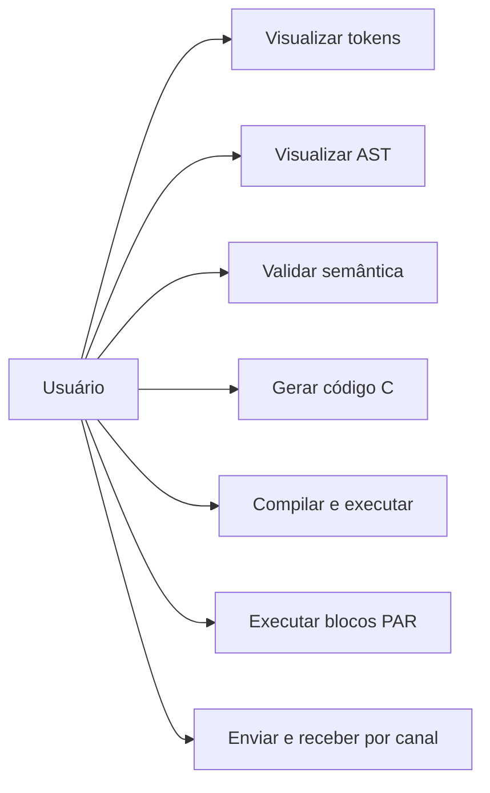
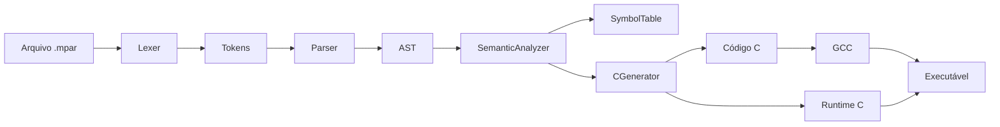
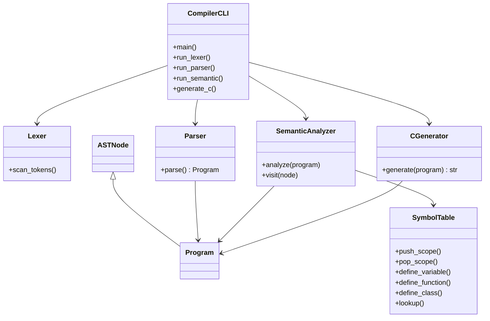

# Diagramas UML do MiniPar

Os blocos abaixo usam Mermaid e podem ser renderizados pelo GitHub ou importados em ferramentas compatíveis.

## Casos de uso

```mermaid
flowchart LR
    U[Usuário] --> T[Visualizar tokens]
    U --> A[Visualizar AST]
    U --> S[Validar semântica]
    U --> C[Gerar código C]
    U --> R[Compilar e executar]
    U --> P[Executar blocos PAR]
    U --> N[Enviar e receber por canal]
```

## Componentes

```mermaid
flowchart LR
    F[Arquivo .mpar] --> L[Lexer]
    L --> TK[Tokens]
    TK --> P[Parser]
    P --> AST[AST]
    AST --> SEM[SemanticAnalyzer]
    SEM --> ST[SymbolTable]
    SEM --> CG[CGenerator]
    CG --> C[Código C]
    C --> GCC[GCC]
    GCC --> EXE[Executável]
    CG --> RT[Runtime C]
    RT --> EXE
```

## Classes principais

```mermaid
classDiagram
    class CompilerCLI {
      +main()
      +run_lexer()
      +run_parser()
      +run_semantic()
      +generate_c()
    }
    class Lexer {
      +scan_tokens()
    }
    class Parser {
      +parse() Program
    }
    class ASTNode
    class Program
    class SemanticAnalyzer {
      +analyze(program)
      +visit(node)
    }
    class SymbolTable {
      +push_scope()
      +pop_scope()
      +define_variable()
      +define_function()
      +define_class()
      +lookup()
    }
    class CGenerator {
      +generate(program) str
    }

    ASTNode <|-- Program
    CompilerCLI --> Lexer
    CompilerCLI --> Parser
    CompilerCLI --> SemanticAnalyzer
    CompilerCLI --> CGenerator
    Parser --> Program
    SemanticAnalyzer --> SymbolTable
    SemanticAnalyzer --> Program
    CGenerator --> Program
```
